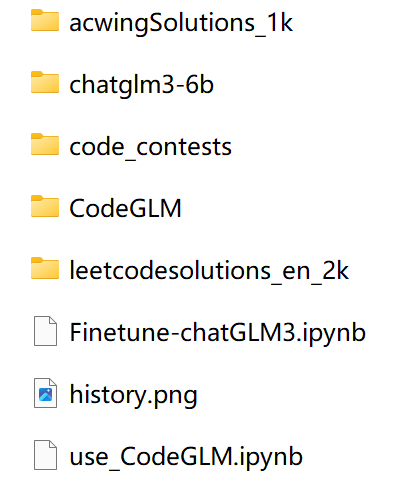

# CodeGLM
运行FineTune-chatGLM3.ipynb及use_CodeGLM.ipynb需要下载以下仓库：

## THUDM/chatglm3-6b
地址：https://huggingface.co/THUDM/chatglm3-6b

## deepmind/code_contests
地址： https://huggingface.co/datasets/deepmind/code_contests

## RicardoPw/acWingSolutions_1k
https://huggingface.co/datasets/RicardoPw/acWingSolutions_1k

## dim/leetcodesolutions_en_2k
https://huggingface.co/datasets/dim/leetcodesolutions_en_2k

# 最终文件目录如下
